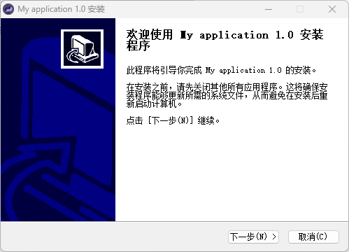
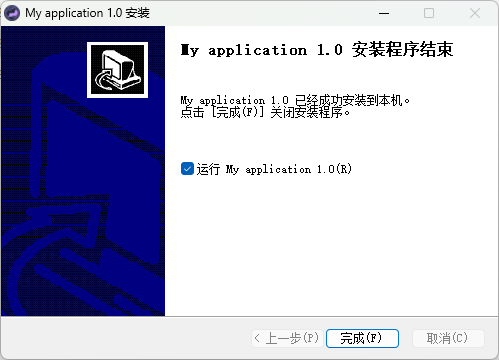
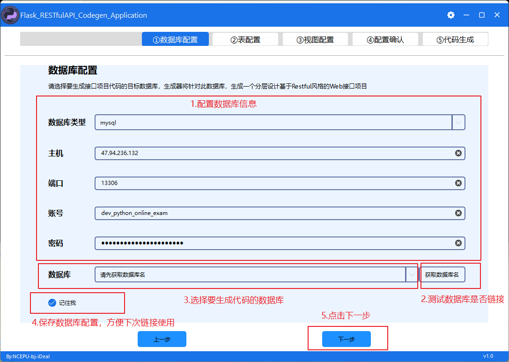
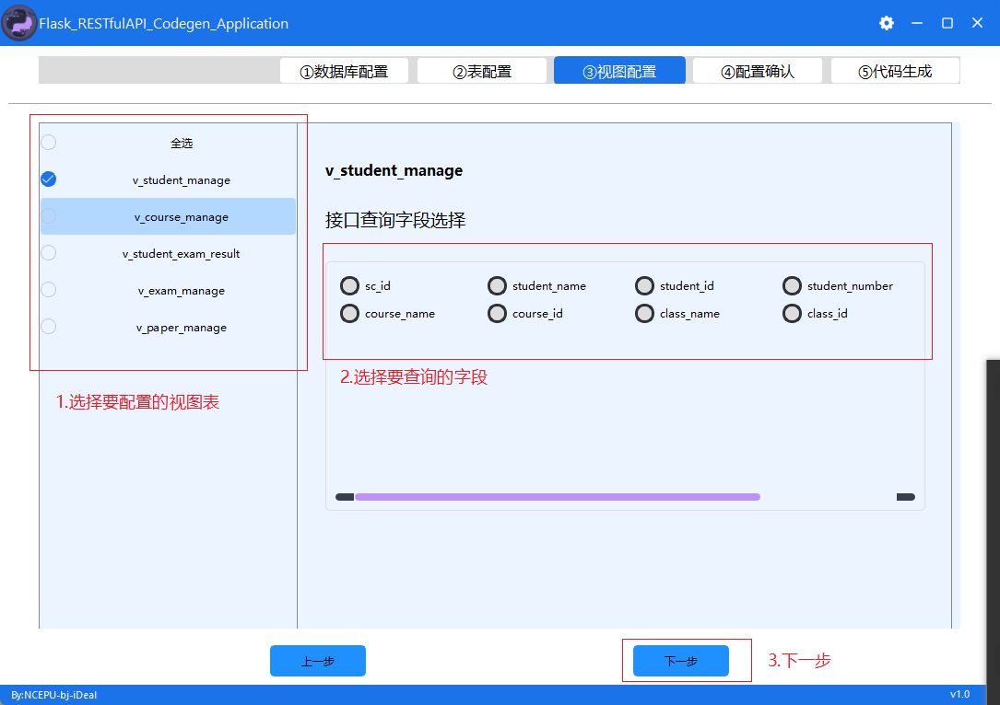
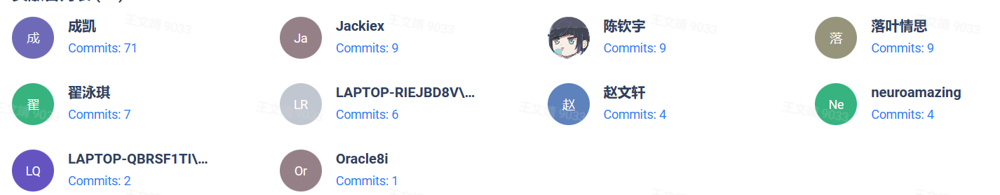

# Flask_RESTfulAPI_Codegen_Application

## Description
### Project name
Python interface project code generator desktop application
### Project code style and basic structure
According to the existing database table structure, the complete basic interface project of Python (including interface documentation) can be automatically generated;
The generated target project is based on the Flask+sqlalchemy framework; The resulting interface conforms to the RESTFUL style specification;
The entity layer of this project is generated based on the flask-sqlacodegen tool, the control layer and resource layer and the service layer code, and the custom code template is generated;
The basic interface has been generated, and the user only needs to expand and add interfaces related to the specific business logic on this basis;

## Software Architecture

1. The project architecture meets the hierarchical design specifications, which is divided into entity layer, controller layer and resource layer (interface layer),
2. Users can add service layer as business logic layer;
3. The resource layer (interface layer) generates an interface that meets the restful style specifications, and after release, it can be directly called by the front-end;
4. In the production environment, users can extend the interface layer by themselves and connect with the newly added service layer (specific business logic) code;
5. The project is positioned on the first database table design (database and table design specifications, see the instructions for use below), and then generate objects and entities and the code of each layer based on these relationships;
6. The target project contains a deployment script based on the Docker container;
7. Automatic generation of unit test code;
### 项目详细目录
└── api.sqlcodegen.com  
    ├── app  # The project initialization folder  
    │   ├── __init__.py  
    │   └── setting.py  
    ├── config  # Project configuration  
    │   └── config.conf  
    ├── models # Entity Layer -- The entity corresponding to the data table  
    │   └── userInfoModel.py  
    ├── controller  # Controller layer -- responsible for adding, deleting, modifying, and checking table records  
    │   └── userInfoController.py  
    ├── service  # Business layer -- Responsible for the writing of the main business logic of the project  
    │   └── userInfoService.py  
    ├── api_1_1  # Resource layer -- responsible for exposing the interface externally  
    │   ├── apiVersionResource  
    │   │   ├── apiVersionResource.py  
    │   │   ├── __init__.py  
    │   │   └── urls.py  
    │   └── userInfoResource  
    │       ├── __init__.py  
    │       ├── urls.py  
    │       ├── userInfoOtherResource.py  
    │       └── userInfoResource.py   
    ├── deploy  # The configuration file for the project deployment  
    │   ├── gunicorn.conf  
    │   ├── nginx_flask.conf  
    │   └── supervisord.conf  
    ├── common  
    ├── docker-compose.yml  
    ├── dockerfile  
    ├── gunicorn.py  
    ├── manage.py  
    ├── requirements.txt  
    └── utils  # Common method toolkit  
        ├── commons.py  
        ├── loggings.py  
        ├── response_code.py  
        └── rsa_encryption_decryption.py 

## Installation

### Download address
tentative
### Installation
#### Run the installer

#### Select the installation path

#### Desktop shortcut generation

#### Instructions

### Desktop UI description
#### Home
Connect to and check the database you want to use to generate the code

#### Entity table configuration page
Select and configure the entity table for which you want to generate code

The field type is tinyint/int/bigint, etc., and the following is replaced by a numeric field
The field type is varchar/text, etc., and the following is replaced by a string field

##### Tombstone fields：

We divide the operation of deleting database records into soft delete, hard delete refers to deleting a record from disk when it is deleted, and soft delete refers to selecting an identification field to change its value when deleting a record to mark that the record has been deleted.

This identification field is called a tombstone field.

The recommended name isDelete/IsDelete/isDeleted/IsDeleted.

Numeric fields can be set as tombstone fields.

##### Business primary key field：

When we do database table design, we generally have an auto-increment primary key AutoID, but we generally do not use this AutoID to add, delete, modify, and check the database, but use custom rules to generate (you can also add through interface parameters) a field to identify a unique record, and use it to operate on a single record in the database.

This field is called the business primary key field.

Recommended naming depends on specific tables, such as Student--StudentID, Teacher--TeacherID, etc.

Field types are not restricted, but cannot be incremented.

At the same time, business primary key generation rules use no generation rules (default) and defined rules:
'create_random_id' - use time + N digits of random numbers to generate random IDs (only this generation rule can be selected for numeric fields)
'create_hashlib_id' - Generate random IDs using time + hashlib
'create_uid' - Generate random IDs using uids

##### Encrypt fields：

Some field information is not intended to be stored in plaintext in the database for security reasons, we will encrypt the information and then store it in the database, and then perform corresponding verification operations on the backend when the information needs to be verified.

The string field type can be set to an encrypted field.

The RSA public and private key is configured in config/security.conf.
#### View table configuration page
Select and configure the view table for which you want to generate code

#### Database configuration confirmation
Verify that the previous entity tables and view tables are configured correctly

#### The target base interface project configuration to build
Configure the target project code to be generated, and you can save the configuration information of this build for next use

## Contribution

## Product characteristics

+ Supports SQLAlchemy 0.8.x - 1.3.x
+ Supports SQLAlchemy 0.8x - 1.3x
+ Produces declarative code that almost looks like it was hand written
+ The generated declarative code almost looks handwritten
+ Produces PEP 8_ compliant code
+ The generated code conforms to the PEP 8_ specification
+ Accurately determines relationships, including many-to-many, one-to-one
+ Accurate judgment includes many-to-many vs. one-to-one relationships
+ Automatically detects joined table inheritance
+ Automatically detect join table inheritance
+ Excellent test coverage
