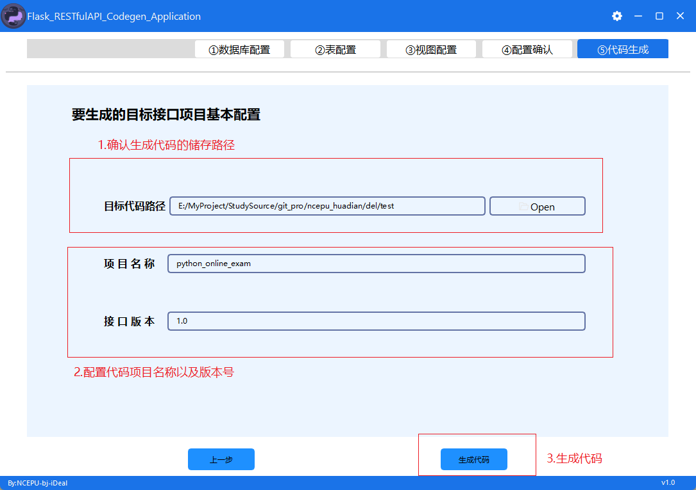

# Flask RESTful风格接口生成器桌面版

## 介绍
### 项目名称
Python接口项目代码生成器桌面应用程序
### 下载
<a href="https://gitee.com/ncepu-bj/Flask_RESTfulAPI_Codegen_Application/releases/tag/v1.0" target="_blank">代码生成器桌面版v1.0</a>
### 项目代码风格及基本结构
能根据已有数据库表结构，自动生成Python完整的基础接口项目(包含接口的文档)；
生成的目标项目基于Flask+sqlalchemy框架；所生成的接口符合restful风格规范；
本项目实体层基于flask-sqlacodegen工具生成，控制层和资源层以及服务层代码，基于自定义代码模板生成；
基本接口已经生成，用户只需要在此基础上进行扩展增加和具体商业逻辑相关的接口即可；

## 软件架构

1. 项目架构满足分层设计规范，分为实体层，控制器层和资源层(接口层)，
2. 用户可以添加服务层，作为商业逻辑层；
3. 资源层(接口层)，生成了满足restful风格规范的接口，发布后，可以直接让前端调用；
4. 生产环境中，用户可以自行扩展接口层，对接新增加的服务层(具体商业逻辑)代码；
5. 项目定位于先有数据库表设计(数据库及表设计规范，见下面的使用说明)，后基于这些关系生成对象和实体及各层的代码；
6. 目标项目包含基于Docker容器的部署脚本；
7. 自动化生成单元测试代码；
### 项目详细目录
└── api.sqlcodegen.com  
    ├── app  # 项目初始化文件夹  
    │   ├── __init__.py  
    │   └── setting.py  
    ├── config  # 项目配置  
    │   └── config.conf  
    ├── models # 实体层 -- 数据表对应的实体  
    │   └── userInfoModel.py  
    ├── controller  # 控制器层 -- 负责表记录的增删改查  
    │   └── userInfoController.py  
    ├── service  # 业务层 -- 负责项目主要业务逻辑的编写  
    │   └── userInfoService.py  
    ├── api_1_1  # 资源层 -- 负责对外暴露接口  
    │   ├── apiVersionResource  
    │   │   ├── apiVersionResource.py  
    │   │   ├── __init__.py  
    │   │   └── urls.py  
    │   └── userInfoResource  
    │       ├── __init__.py  
    │       ├── urls.py  
    │       ├── userInfoOtherResource.py  
    │       └── userInfoResource.py   
    ├── deploy  # 项目部署的配置文件  
    │   ├── gunicorn.conf  
    │   ├── nginx_flask.conf  
    │   └── supervisord.conf  
    ├── common  
    ├── docker-compose.yml  
    ├── dockerfile  
    ├── gunicorn.py  
    ├── manage.py  
    ├── requirements.txt  
    └── utils  # 常用方法工具包  
        ├── commons.py  
        ├── loggings.py  
        ├── response_code.py  
        └── rsa_encryption_decryption.py  
## 安装教程

### 下载地址
暂定

## 使用指南
- <a href="https://idealstudio-ncepu.yuque.com/kgagg7/prnusl?# 《Python接口项目代码生成器（桌面版）》" target="_blank">使用指南</a>

### 安装
#### 运行安装程序

#### 选择安装路径

#### 桌面快捷方式生成

## 使用说明

### 桌面UI说明
#### 首页
连接并选中要使用生成代码的数据库

#### 实体表配置页
选中并配置要生成代码的实体表

字段类型为tinyint/int/bigint等，以下以数字型字段代替
字段类型为varchar/text等，以下以字符串型字段代替

##### 逻辑删除字段：

我们将删除数据库记录的操作分为软删除和硬删除，硬删除是指删除记录时从磁盘中删除，软删除则是指删除记录时选择一个标识字段来改变它的值以标记该记录已被删除。

这个标识字段则称为逻辑删除字段。

推荐命名为isDelete/IsDelete/isDeleted/IsDeleted.

数字型字段可被设置为逻辑删除字段。

##### 业务主键字段：

我们做数据库表设计时，一般会有一个自增主键AutoID，但我们一般不会使用这个AutoID来进行数据库的增删改查操作，而是用自定义的规则来生成(也可以通过接口传参来添加)一个字段来标识唯一记录，并用它在数据库对单条记录进行操作。

这个字段则称为业务主键字段。

推荐命名依赖于具体的表，比如Student--StudentID，Teacher--TeacherID等。

字段类型不作限制，但不能自增。

同时，业务主键生成规则使用无生成规则(默认)与已定义的规则：
'create_random_id'-使用时间+N位随机数生成随机ID(数字型字段只能选择此种生成规则)
'create_hashlib_id'-使用时间+hashlib生成随机ID
'create_uid'-使用uid生成随机ID

##### 加密字段：

有些字段的信息出于安全考虑，并不希望在数据库中明文存储，我们会将信息加密后再存储在数据库中，在需要验证信息时再在后端进行相应的校验操作。

字符串型字段类型可被设置为加密字段。

RSA公私钥请在config/security.conf中配置。
#### 视图表配置页
选中并配置要生成代码的视图表

#### 数据库配置确认
确认先前实体表和视图表的配置是否正确

#### 要生成的目标基本接口项目配置
配置将要生成的目标项目代码，并可以保存本次生成的配置信息，下次使用

## 参与贡献

## 产品特性

+ Supports SQLAlchemy 0.8.x - 1.3.x
+ 支持SQLAlchemy 0.8x - 1.3x
+ Produces declarative code that almost looks like it was hand written
+ 生成的声明性代码几乎看起来像是手写的
+ Produces PEP 8_ compliant code
+ 生成的代码符合 PEP 8_规范
+ Accurately determines relationships, including many-to-many, one-to-one
+ 准确判断包括多对多与一对一的关系
+ Automatically detects joined table inheritance
+ 自动检测连接表继承
+ Excellent test coverage
